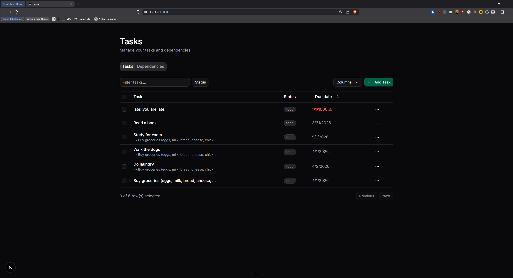
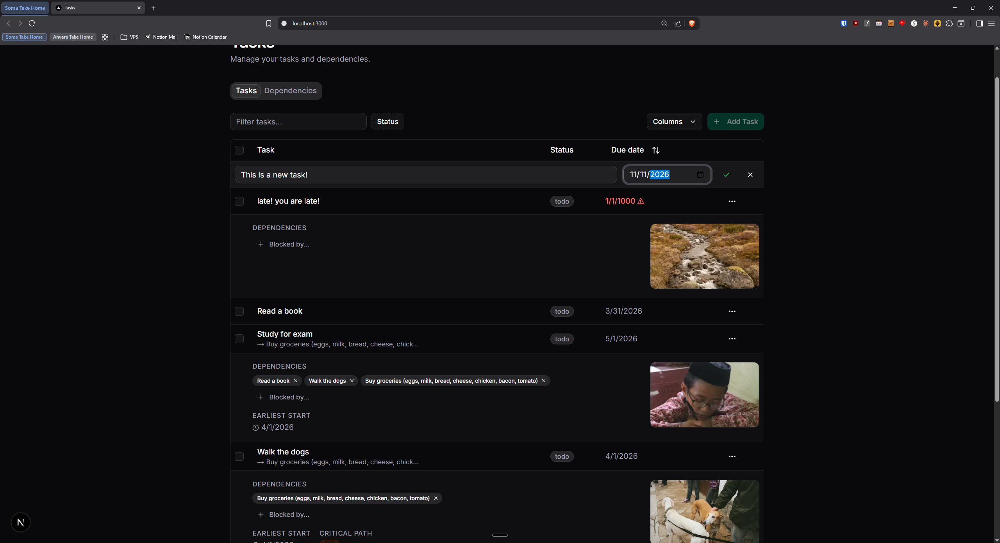
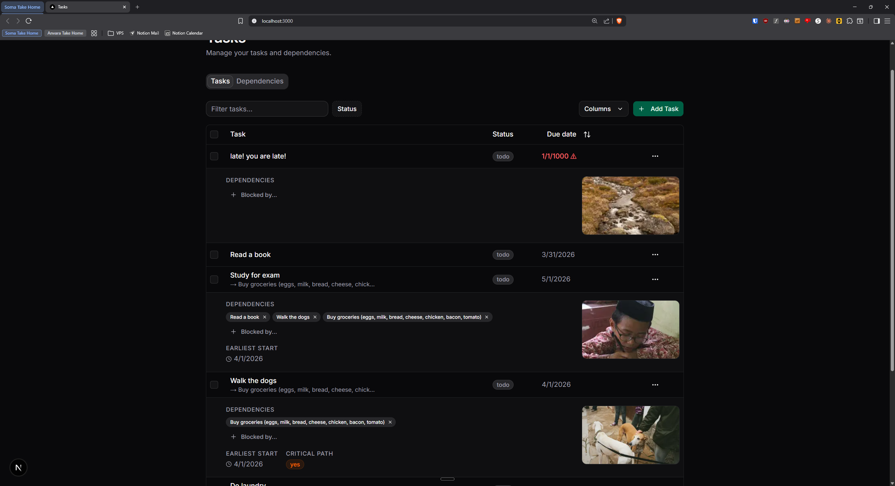
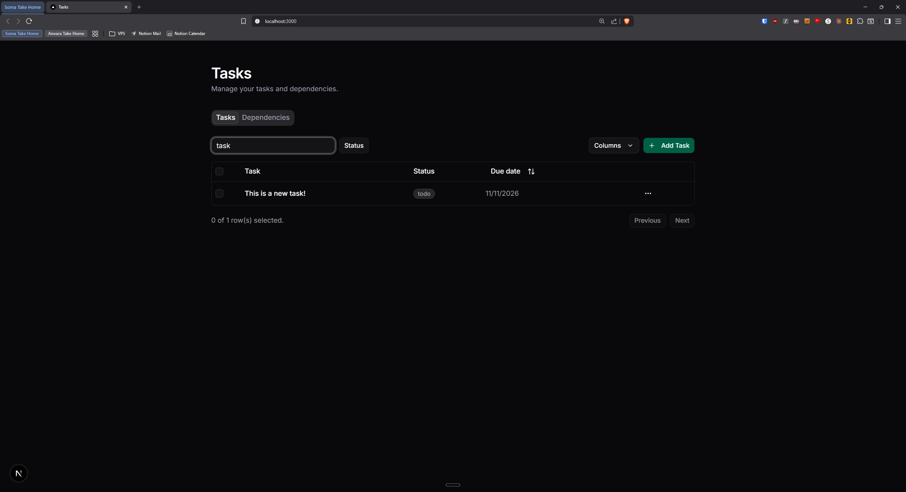
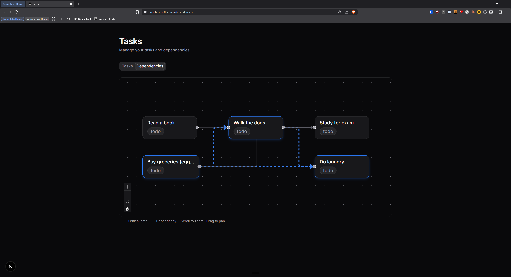

## Soma Capital Technical Assessment Submission

https://soma.avva.dev

### Due Dates

Tasks accept an optional due date via the inline add row. Due dates display as a sortable column in the task table, overdue dates appear in red with a warning indicator.

### Image Previews

On task creation, the Pexels API is queried using the task title. The returned image appears as a thumbnail in the expanded row detail, with an animated skeleton loading state. Clicking the thumbnail opens a full-size preview dialog.

### Task Dependencies

Expanding a task row reveals a dependency selector with search and multi-select. Cycle detection runs both client-side (disabling invalid options in the selector) and server-side (rejecting the mutation) using DFS reachability. The graph algorithms (Kahn's topological sort, longest-chain critical path, and earliest-start-date propagation) live in `src/lib/graph/` as pure functions.

Switching to the "Dependencies" tab shows an interactive React Flow graph with hierarchical layout. Critical path edges are animated and highlighted in blue; non-critical edges are dimmed. Each expanded task row also shows its computed earliest start date and critical path membership.

### Tech Choices

- **Server Components + Server Actions**: data fetches via Prisma with no client-side waterfall; only interactive leaves are client components
- **TanStack React Table**: sortable, filterable task table with expandable rows
- **nuqs**: tab state persisted in the URL for shareability
- **shadcn/ui**: consistent component library (Radix + Tailwind)

### Screenshots

_Task list with sortable due dates. Overdue dates shown in red_

_Inline task creation with optional due date_

_Expanded rows showing Pexels image preview, dependency selector, earliest start date, and critical path membership_

_Filtering tasks by status_

_Interactive dependency graph with critical path highlighted in blue_
